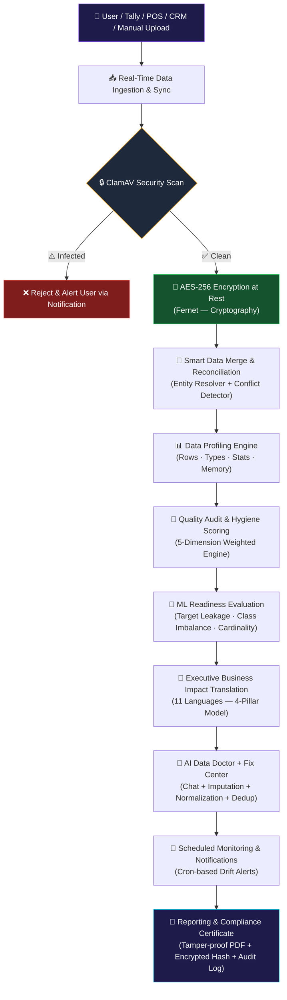

<div align="center">

# 🧠 QUALIX AI

### Secure AI Readiness Operating System for MSMEs

*Your AI Data Doctor — From Raw, Messy Data to a Certified, Executive-Ready Score*

<p>
  
  
  
  
  
  
  
  
  
  
</p>

### 🚀 Turn **Data Chaos** → **Data Confidence** → **AI Readiness**

<p>
  <b>🔒 Secure</b> &nbsp;•&nbsp;
  <b>🧹 Diagnose</b> &nbsp;•&nbsp;
  <b>🤖 Score</b> &nbsp;•&nbsp;
  <b>💼 Explain</b> &nbsp;•&nbsp;
  <b>💊 Fix</b> &nbsp;•&nbsp;
  <b>📊 Monitor</b> &nbsp;•&nbsp;
  <b>📄 Certify</b>
</p>

</div>

---

## 🏆 Why Qualix AI?

> **AI projects don't fail only because of bad models. They fail because the data was never ready.**

MSMEs work with spreadsheets, POS exports, Tally ledgers, CRM dumps, and fragmented operational data. Missing values, duplicate records, inconsistent formats, schema mismatches, and security risks quietly destroy AI initiatives before they begin.

**Qualix AI is built to solve that — end to end.**

Instead of handing a business owner yet another technical error report, Qualix AI answers the questions that *actually matter*:

| Question | Answer Qualix AI Provides |
|---|---|
| 🔍 **How healthy is my data?** | Weighted 5-dimension hygiene score (0–100) |
| 🤖 **Is my data ready for AI/ML?** | ML Readiness Score with explicit penalty breakdown |
| 💰 **What business risk is this creating?** | Executive-language impact across 11 languages |
| 🔧 **What should I fix first?** | Prioritized, actionable fix list |
| 🛡️ **Is my data ingestion secure?** | ClamAV scan + Fernet AES-256 encryption pipeline |
| 📄 **Can I prove it was assessed?** | Tamper-proof PDF Compliance Certificate |

---

## 💡 The Core Idea

```
Raw Data ──► Secure Ingestion ──► Smart Merge ──► Profiling
     ──► Quality Audit ──► AI Readiness ──► Business Impact
          ──► Remediation ──► Monitoring ──► Certification
```

---

## 🎯 The Problem We Solve

MSME data is often **messy, inconsistent, and unstructured** — causing AI/BI initiatives to stall before delivering business value.

| Data Problem | Business Consequence |
|---|---|
| ❌ Missing / null values | Revenue and customer insights become structurally incomplete |
| 🔁 Duplicate records | Customer/vendor counts become inflated; campaigns mis-targeted |
| 🔀 Schema mismatches | ERP, CRM, and operational data silently fail to merge |
| 🦠 Unsafe uploads | Malicious files introduce security and compliance risk |
| 🧩 Fragmented sources | Teams lack one unified view of the business |
| 🧑‍💻 Technical-only diagnostics | Executives cannot act on raw data-quality error codes |

### 🔥 Our Core Differentiator

> Qualix AI does **not** stop at *"your data is bad."*

It connects the entire chain:

```
Technical Finding  ──►  Business Meaning  ──►  Recommended Fix
```

This makes data quality **understandable and actionable** for both technical teams and business decision-makers.

---

## 🗺️ End-to-End Platform Workflow



---

## 🚀 What Qualix AI Delivers

| Capability | What It Does |
|---|---|
| 📊 **AI/ML Readiness Score** | Definitive 0–100 score indicating ML pipeline viability |
| 🧹 **5-Dimension Hygiene Score** | Completeness · Consistency · Duplication · Structure · Anomaly |
| 🔗 **Smart Data Merge** | Reconciles fragmented datasets via Entity Resolution |
| 🛡️ **Zero-Trust Ingestion** | ClamAV scans every file before it touches the pipeline |
| 🔐 **AES-256 Encryption** | All data encrypted at rest using Fernet immediately on upload |
| 🤖 **ML Diagnostics** | Detects target leakage, class imbalance, and cardinality issues |
| 💼 **Business Impact Translation** | Converts technical findings into executive-level risk statements |
| 🌍 **11-Language Support** | Structured 4-pillar explanations in 11 languages |
| 💊 **AI Data Doctor** | Interactive chat to query diagnostic results in plain language |
| 🔧 **Fix Center** | Imputation, normalization, deduplication, and column drop tools |
| 🔔 **Live Monitoring** | Cron-based hygiene/drift alerts below configurable threshold |
| 📄 **Compliance Certificate** | Tamper-resistant PDF with hashes, timestamps, and audit log |
| 🎭 **RBAC** | Admin / Data Analyst / Viewer — strict module-level gating |

---

## 🧠 The "AI Data Doctor" Experience

> Qualix AI treats a dataset **like a patient**.

```
🩺 DIAGNOSE       Profile the dataset · Identify quality problems
       │
       ▼
📋 PRESCRIBE      Generate a clear, prioritized remediation path
       │
       ▼
💊 FIX            Apply data-cleaning and remediation actions
       │
       ▼
❤️  MONITOR        Track data health · Detect deterioration over time
       │
       ▼
🏆 CERTIFY        Generate a compliance certificate with assessment details
```

---

## 🔒 Security First: Zero-Trust Data Ingestion

Security is **built into the ingestion workflow** — not added as an afterthought.

```
         📤 DATA UPLOAD
                │
                ▼
    ┌─────────────────────┐
    │  🔒 ClamAV SCAN     │
    └──────────┬──────────┘
               │
       ┌───────┴────────┐
       │                │
  ⚠️ INFECTED      ✅ CLEAN
       │                │
       ▼                ▼
  ❌ REJECT         🔐 AES-256
   + ALERT          ENCRYPTION
                        │
                        ▼
                  🧠 PROCESS DATA
```

**Security capabilities:**
- ✅ ClamAV malware scanning before any processing
- ✅ Fernet / AES-256 encryption at rest
- ✅ PII / Sensitive / Financial column auto-classification + masking
- ✅ Role-based raw-data visibility controls
- ✅ Immutable audit log generation
- ✅ Encrypted dataset hashes embedded in compliance certificates

---

## 📊 Five-Dimension Data Hygiene Engine

| Dimension | Weight | What It Measures |
|---|:---:|---|
| **Completeness** | **25%** | Non-null cell coverage across the entire dataset |
| **Consistency** | **25%** | Casing irregularities, format conflicts, type mismatches |
| **Duplication** | **20%** | Unique row ratio + RapidFuzz fuzzy near-duplicate penalty |
| **Structure** | **15%** | Schema adherence and type mismatch deductions |
| **Anomaly** | **15%** | IQR-based numeric outlier detection per column |

### 🧮 Base Hygiene Score Formula

```
Base Score = (Completeness × 0.25)
           + (Consistency  × 0.25)
           + (Duplication  × 0.20)
           + (Structure    × 0.15)
           + (Anomaly      × 0.15)
```

---

## 🤖 AI/ML Readiness Engine

Qualix AI goes beyond traditional data-quality checks. It evaluates **ML-specific risks:**

- 🚨 **Target Leakage** — features that directly encode the prediction target
- ⚖️ **Severe Class Imbalance** — distribution skew > 80%
- 🔢 **Cardinality Constraints** — extreme unique-value ratios
- 📈 **Feature Distributions** — via Plotly visualizations
- 🔗 **Correlation Patterns** — full correlation matrix
- 🎯 **Anomaly Detection** — IQR scatter plots

### 🎯 ML Readiness Formula

```
ML Readiness = Base Score × 0.80
             − 25 pts  →  if Target Leakage detected
             − 15 pts  →  if Class Imbalance > 80%

Final Score  = clamp(ML_Readiness, min=10, max=100)
```

```
   DATASET HEALTH
          │
  ┌───────┴────────┐
  │                │
Quality Score    ML Risks
  │                │
  ▼                ▼
5 Pillars     ┌──────────────┐
 (0–100)      │ Leakage      │
              │ Imbalance    │
              │ Cardinality  │
              └──────┬───────┘
                     │
          ┌──────────┴──────────┐
          ▼                     ▼
   🤖 AI READINESS SCORE   💼 BUSINESS IMPACT
```

---

## 🌍 From Technical Errors to Business Decisions

One of Qualix AI's **strongest differentiators** is its Domain-Structured Local Language AI Explanation Engine (`services/local_language_ai.py`).

Instead of showing:
```
"25% null values in col_Phone"
```

Qualix AI transforms it into a **business-readable 4-pillar explanation:**

### The 4-Pillar Explanation Model

| Pillar | Purpose | Audience |
|---|---|---|
| 🔍 **Finding** | What exactly was detected | Everyone |
| 💼 **Business Meaning** | How it affects operations, revenue, or cashflow | Executives / Owners |
| 🧠 **Technical Explanation** | Why the issue exists at the data level | Analysts / Engineers |
| 🔧 **Recommended Fix** | What action should be taken | Both |

### Live Example

```
TECHNICAL FINDING
  18% of customer phone numbers are missing across 182 rows
            │
            ▼
BUSINESS MEANING
  Customer communication, SMS payment reminders, and duplicate
  customer identification are impacted — risking revenue leaks
            │
            ▼
TECHNICAL EXPLANATION
  Null / empty strings detected in 'Phone' / 'Contact' column
  across 182 rows during profile scan
            │
            ▼
RECOMMENDED FIX
  Extract missing numbers from Tally ledger notes,
  or prompt sales reps to update missing contacts
```

### 🌐 Supported Languages — 11 Total

| Flag | Language | Native Script | Code |
|---|---|---|:---:|
| 🇬🇧 | English | English | `en` |
| 🇮🇳 | Hindi | हिन्दी | `hi` |
| 🇮🇳 | Tamil | தமிழ் | `ta` |
| 🇮🇳 | Telugu | తెలుగు | `te` |
| 🇮🇳 | Kannada | ಕನ್ನಡ | `kn` |
| 🇮🇳 | Bengali | বাংলা | `bn` |
| 🇮🇳 | Marathi | मराठी | `mr` |
| 🇮🇳 | Gujarati | ગુજરાતી | `gu` |
| 🇪🇸 | Spanish | Español | `es` |
| 🇫🇷 | French | Français | `fr` |
| 🇩🇪 | German | Deutsch | `de` |

> **Design choice:** The MVP uses a **static domain dictionary** — zero per-row LLM cost, zero live internet dependency.

---

## 🔗 Smart Data Merge

Real MSME data rarely lives in one clean file. Qualix AI reconciles fragmented sources:

```
   CRM          TALLY          POS
    │              │             │
    └──────┐  ┌───┘  ┌──────────┘
           ▼  ▼      ▼
      🔗 ENTITY RESOLVER
              │
              ▼
       ⚠️ CONFLICT DETECTOR
              │
              ▼
        🧩 MERGE ENGINE
              │
              ▼
      📊 UNIFIED DATA VIEW
```

**Key components:**
- Entity Resolution (`entity_resolver.py`)
- Schema Auto-Matching (`schema_matcher.py`)
- Conflict Detection (`conflict_detector.py`)
- Intelligent Merge (`merge_engine.py`)
- Schema Drift Detection (`schema_drift.py`)

---

## 💊 Fix Center — From Detection to Remediation

> Qualix AI doesn't just identify problems — it provides **a path to fix them.**

```
  Detect ──► Explain ──► Recommend ──► Fix
```

**Supported remediation actions:**
- 🧹 Missing value **Imputation**
- 🔤 **Title-Case / Normalization** of inconsistent strings
- 🔁 **Deduplication** of exact and fuzzy-matched rows
- 🗑️ **Dropping target-leakage columns**
- 🧩 **Data reconciliation** across merged sources
- 📐 **Schema correction** via column alias rules

---

## 📡 Monitoring & Alerts

> Data quality is **not a one-time event.** A healthy dataset today can become unhealthy tomorrow.

```
  Healthy Data
       │
       ▼
  📊 Scheduled Scan (Cron-based)
       │
       ▼
  Score Changed?
  │            │
  NO           YES
  │            │
  ▼            ▼
  ✅        ⚠️ ALERT
             │
             ▼
         INVESTIGATE
             │
             ▼
           🔧 FIX
```

---

## 📄 Compliance & Certification

After assessment, Qualix AI generates a **tamper-resistant PDF Compliance Certificate** containing:

- ✅ Weighted 5-dimension hygiene scores
- ✅ Final ML Readiness Score
- ✅ Encrypted dataset hash (SHA-256 + Fernet)
- ✅ ISO timestamp of the assessment
- ✅ Immutable audit log summary
- ✅ Penalty breakdown (leakage / imbalance)

> This turns a diagnostic result into a **shareable, auditable evidence artifact.**

---

## 🎭 Enterprise-Style RBAC

| Capability | 👑 Admin | 🔬 Data Analyst | 👁️ Viewer |
|---|:---:|:---:|:---:|
| Dashboard & Charts | ✅ | ✅ | ✅ |
| Data Profiler | ✅ | ✅ | ✅ |
| Quality Audit Results | ✅ | ✅ | ✅ |
| AI Readiness Score | ✅ | ✅ | ✅ |
| Business Impact Ledger | ✅ | ✅ | ✅ |
| Reports / Certificate | ✅ | ✅ | ✅ Read-only |
| Raw Data Preview | ✅ Full | ⚠️ PII Masked | ❌ Blocked |
| System Integrations / Ingest | ✅ | ✅ | ❌ |
| Smart Data Merge | ✅ | ✅ | ❌ |
| Fix Center / Remediation | ✅ | ✅ | ❌ |
| Monitoring / Alert Setup | ✅ | ✅ | ❌ |
| Security / ClamAV Controls | ✅ | ❌ | ❌ |

---

## 🖥️ 14-Screen Product Journey

| # | Module | Role Access | Key Function |
|---|---|---|---|
| 01 | 🔐 **Secure Login & RBAC** | All | Authenticate by role |
| 02 | 📊 **Dashboard Overview** | All | Live vitals — Hygiene, AI Readiness, Security |
| 03 | 🔗 **System Integrations** | Admin, Analyst | CRM / Tally / POS connectors + upload; ClamAV gate |
| 04 | 🧩 **Smart Data Merge** | Admin, Analyst | Reconcile fragmented datasets |
| 05 | 🎯 **Intelligent Scan Scope** | Admin, Analyst | Include/exclude columns from audit |
| 06 | 🔎 **Data Analyzer & Profile** | All | Schema, rows, memory, statistical distributions |
| 07 | 🧹 **Data Quality Audit** | All | Flags missing values, casing, mismatches, fuzzy dupes |
| 08 | 🤖 **AI Readiness Engine** | All | Target leakage, class imbalance, cardinality |
| 09 | 📈 **AI/ML Intelligence** | All | Feature distributions, correlations, anomaly scatter plots |
| 10 | 💼 **Business Impact Ledger** | All | Technical → executive risks (11 languages) |
| 11 | 💊 **Fix Center** | Admin, Analyst | Impute, normalize, deduplicate, drop columns |
| 12 | 🧠 **AI Data Doctor** | All | Chat interface to query diagnostics |
| 13 | 🔔 **Scheduled Monitoring** | Admin, Analyst | Cron-based drift alerts |
| 14 | 📄 **Reporting & Certification** | All | Tamper-proof PDF Compliance Certificate |

---

## 🛠️ Technology Stack

### ✅ Implemented (MVP)

| Layer | Technology | Version | Purpose |
|---|---|---|---|
| **Frontend** | Streamlit | 1.32.0 | Dashboard UI + Glassmorphism CSS |
| **Visualization** | Plotly | 5.19.0 | Interactive analytics charts |
| **Backend** | FastAPI | 0.110.0 | REST API layer |
| **Server** | Uvicorn | 0.28.0 | ASGI server |
| **Runtime** | Python | 3.11 | Core platform |
| **Data** | Pandas | 2.2.1 | Dataframe processing engine |
| **Numerical** | NumPy | 1.26.4 | Numerical operations |
| **ML** | Scikit-Learn | 1.4.1 | ML diagnostics — leakage, imbalance |
| **Matching** | RapidFuzz | 3.6.2 | Fuzzy duplicate detection (85–88% threshold) |
| **Security** | Cryptography (Fernet) | 42.0.5 | AES-256 encryption at rest |
| **Security** | ClamAV | system | Pre-ingestion malware scanning |
| **Reporting** | ReportLab | latest | PDF Compliance Certificate generation |
| **Excel** | OpenPyXL | 3.1.2 | `.xlsx` read/write |
| **Validation** | Pydantic | 2.13.4 | API request/response schema validation |
| **HTTP** | HTTPX | 0.26.0 | Internal async API calls |
| **Uploads** | python-multipart | 0.0.9 | File upload multipart handling |

### 🔮 Planned Production Stack

> `React / Next.js` · `TailwindCSS` · `Apache Kafka` · `PostgreSQL` · `Snowflake` · `Elasticsearch` · `Apache Spark / PySpark` · `MLflow` · `NVIDIA Triton` · `Keycloak` · `Cloudflare WAF` · `HashiCorp Vault` · `Local Llama 3`

---

## 📁 Project Structure

```
qualix-ai/
│
├── backend/
│   └── main.py                     # FastAPI app — all REST API endpoints
│
├── frontend/
│   ├── app.py                      # Streamlit dashboard — all 14 screens
│   └── login_bg.png                # Login background asset
│
├── services/                       # 29 modular microservice files
│   ├── rbac.py                     # Role-Based Access Control
│   ├── clamav_scanner.py           # Pre-ingestion malware scanning
│   ├── encryption.py               # Fernet AES-256 encrypt/decrypt
│   ├── sensitive_scanner.py        # PII/Sensitive/Financial classifier + masking
│   ├── data_profile.py             # Dataset profiling (rows, types, stats)
│   ├── data_quality.py             # 5-dimension hygiene scoring engine
│   ├── ml_readiness.py             # Target leakage & class imbalance detection
│   ├── readiness_score.py          # Weighted score aggregation
│   ├── duplicate_detector.py       # Exact + fuzzy duplicate detection
│   ├── anomaly_detector.py         # IQR-based outlier detection
│   ├── entity_resolver.py          # Cross-source entity resolution
│   ├── conflict_detector.py        # Value conflict detection across sources
│   ├── merge_engine.py             # Intelligent dataset join & reconciliation
│   ├── schema_matcher.py           # Auto column-to-column schema matching
│   ├── schema_drift.py             # Schema change detection between runs
│   ├── scan_scope.py               # Column include/exclude toggling
│   ├── field_classifier.py         # Auto field type classification
│   ├── source_detector.py          # Auto source system identification
│   ├── system_integrator.py        # Live CRM / Tally / POS / ERP connectors
│   ├── local_language_ai.py        # 11-language executive impact translation
│   ├── notification_service.py     # Alert dispatch on hygiene threshold breach
│   ├── scheduled_monitor.py        # Cron-based live monitoring orchestration
│   ├── rule_generator.py           # Custom business validation rule engine
│   ├── inventory_reconciler.py     # Inventory-specific reconciliation
│   ├── payment_reconciler.py       # Payment-specific reconciliation
│   ├── audit_logger.py             # Immutable audit log generation
│   ├── report_generator.py         # PDF Compliance Certificate builder
│   ├── dataset_generator.py        # Synthetic demo dataset generator
│   └── __init__.py
│
├── tests/
│   └── test_api_new_features.py    # API test suite
│
├── data/                           # Sample datasets for demo
├── run.py                          # Unified process launcher (FastAPI + Streamlit)
├── serve.ps1                       # PowerShell one-command launcher (Windows)
├── requirements.txt                # All Python dependencies with pinned versions
├── .env.example                    # Environment variable template
├── .key                            # Auto-generated encryption key (never commit)
├── audit.log                       # Immutable system audit log
└── README.md                       # This file
```

---

## ⚡ Getting Started

### Prerequisites

- **Python 3.11** — [Download](https://www.python.org/downloads/release/python-3119/)
- **Windows + PowerShell** — for the one-command launcher
- **ClamAV** *(optional)* — app degrades gracefully if unavailable

### 1️⃣ Open the Project

```powershell
cd qualix-ai
```

### 2️⃣ Launch Everything — One Command

```powershell
powershell.exe -ExecutionPolicy Bypass -File .\serve.ps1
```

**The launcher automatically:**

1. ✅ Detects your Python 3.11 installation
2. ✅ Stops existing processes on ports `8000` and `8080`
3. ✅ Creates `.venv` virtual environment if not present
4. ✅ Installs / upgrades all dependencies from `requirements.txt`
5. ✅ Starts **FastAPI backend** on `http://127.0.0.1:8000`
6. ✅ Launches **Streamlit dashboard** on `http://localhost:8080`

### 3️⃣ Open the Platform

| Service | URL |
|---|---|
| 🌐 **Qualix AI Dashboard** | **http://localhost:8080** |
| ⚡ **FastAPI Backend** | http://127.0.0.1:8000 |
| 📚 **Swagger API Docs** | http://127.0.0.1:8000/docs |

---

## ⚙️ Configuration

```bash
cp .env.example .env
```

| Variable | Purpose | Default |
|---|---|---|
| `QUALIX_ENCRYPTION_KEY` | Fernet AES-256 key for at-rest encryption | Auto-generated |
| `QUALIX_SECRET_KEY` | Session signature key | Auto-generated |
| `CLAMAV_HOST` | ClamAV daemon host | `127.0.0.1` |
| `CLAMAV_PORT` | ClamAV daemon port | `3310` |
| `DATABASE_URL` | Database URI | SQLite (auto) |

> ⚠️ **Never commit `.env` or `.key` to version control.**

---

## 🔑 Demo Credentials

| Role | Email | Password | Access Level |
|---|---|---|---|
| 👑 **Admin** | `admin@qualix.ai` | `admin123` | Full — all modules, raw data, security controls |
| 🔬 **Data Analyst** | `analyst@qualix.ai` | `analyst123` | Ingestion, audits, fix center; PII masked |
| 👁️ **Viewer** | `viewer@qualix.ai` | `viewer123` | Read-only dashboards and reports |

---

## 📡 API Reference

> Interactive Swagger docs: **http://127.0.0.1:8000/docs**

| Method | Endpoint | Purpose |
|---|---|---|
| `POST` | `/upload` | Upload a CSV / Excel file for scanning |
| `GET` | `/profile` | Get the statistical profile of the loaded dataset |
| `GET` | `/quality` | Run and return the 5-dimension quality audit |
| `GET` | `/readiness` | Compute and return the ML Readiness Score |
| `POST` | `/merge` | Merge multiple uploaded datasets |
| `GET` | `/business-impact` | Get the multilingual business impact translation |
| `POST` | `/fix` | Apply a remediation action to the dataset |
| `GET` | `/certificate` | Generate and download the PDF Compliance Certificate |
| `POST` | `/monitor` | Configure a scheduled monitoring task |
| `GET` | `/notifications` | Retrieve active notifications and alerts |

---

## 🧪 High-Level Algorithm

```
START
  │
  ├── 1. RECEIVE DATA
  │       └── CSV / Excel / CRM / Tally / POS
  │
  ├── 2. SECURE
  │       ├── ClamAV malware scan
  │       └── AES-256 Fernet encryption at rest
  │
  ├── 3. PROFILE
  │       ├── Rows / columns / memory footprint
  │       ├── Data type inference
  │       ├── Null count per column
  │       └── Statistical distributions (mean, median, std)
  │
  ├── 4. RECONCILE (if multi-source)
  │       ├── Entity resolution across sources
  │       ├── Schema auto-matching
  │       └── Conflict detection and resolution
  │
  ├── 5. AUDIT (5-Dimension Engine)
  │       ├── Completeness Score
  │       ├── Consistency Score
  │       ├── Duplication Score (+ RapidFuzz)
  │       ├── Structure Score
  │       └── Anomaly Score (IQR)
  │
  ├── 6. ML EVALUATE
  │       ├── Target leakage check  → −25 pts
  │       ├── Class imbalance check → −15 pts
  │       └── Clamp to [10, 100]
  │
  ├── 7. TRANSLATE
  │       └── Technical issue → 4-Pillar Business Impact (11 languages)
  │
  ├── 8. REMEDIATE
  │       └── Fix Center — Impute / Normalize / Dedupe / Drop
  │
  ├── 9. MONITOR
  │       └── Cron-based scheduled drift alerts
  │
  └── 10. CERTIFY
          └── PDF + encrypted hash + timestamp + audit log
```

---

## 🧩 Key Engineering Decisions

| Decision | Rationale |
|---|---|
| ⚡ **Static Domain Dictionary** | Zero per-row LLM cost; no live internet dependency in the translation engine |
| 🔐 **Security Before Processing** | Files pass through ClamAV gate before entering any data pipeline |
| 🎭 **RBAC by Design** | Raw-data visibility and admin controls are restricted at the architecture level |
| 🧠 **Technical + Business Intelligence** | Same diagnostic consumed differently by analysts and executives |
| 📊 **Explainable Scoring** | Score built from visible weighted dimensions and defined ML penalties — not a black box |

---

## ⚠️ Assumptions & Challenges

### Assumptions

- **Tabular Focus** — MVP targets CSV and Excel; JSON/XML deferred to v2
- **In-Memory Scale** — Datasets assumed < 1 GB for Pandas-based processing
- **Non-Technical Users** — MSME owners are key consumers; executive translation is mandatory
- **Static Translation** — MVP uses a pre-built domain dictionary; no LLM dependency
- **Secure Host** — ClamAV assumed to run in a suitable sandboxed environment

### Challenges

| Challenge | Why It Matters |
|---|---|
| ⚙️ **Performance** | RapidFuzz fuzzy matching is CPU-intensive on large datasets |
| 🔀 **Relational Complexity** | Sales, inventory, and CRM files may have different schemas |
| ⚡ **Real-Time Integration** | Live Tally/POS/CRM normalization can create processing bottlenecks |
| 🕐 **Monitoring Reliability** | Long-running scheduled jobs need reliable execution in Streamlit |
| 📉 **Schema Drift** | Source exports can change field names unexpectedly |
| ⚖️ **Conflict Resolution** | Multiple sources can disagree about the same entity's values |
| 📏 **Readiness Subjectivity** | A universal 0–100 score must work across retail, logistics, and finance |
| 🌐 **Localization Accuracy** | Business meaning must stay clear and nuanced across 11 languages |
| 🔔 **Alert Fatigue** | Notifications must remain useful — not overwhelming for business users |
| 🔒 **PII Masking Accuracy** | Column classification must prevent accidental data exposure by role |

---

## 🔮 Roadmap

| 🚀 Enhancement | Vision |
|---|---|
| 🗄️ **Direct Database Connectors** | Native MySQL, PostgreSQL, MongoDB, AWS S3, Google Drive |
| 🤖 **Generative AI / LLM** | Local Llama 3 for dynamic, contextual business impact explanations |
| ⚡ **Distributed Processing** | PySpark / Dask for datasets exceeding single-node memory |
| 🔄 **Automated ETL Pipelines** | Fully automated real-time data-cleaning pipelines |
| 🛡️ **Advanced Threat Detection** | ML models to detect adversarial data poisoning attacks |
| ☁️ **Cloud Deployment** | Docker + Kubernetes + Cloudflare WAF + Keycloak IAM |
| 📱 **Mobile Dashboard** | React Native executive monitoring companion app |

---

## 🏅 Why This Can Win

### 1. 🎯 It solves a **real, widespread MSME problem**
Not every organization has a data scientist — but every organization depends on data to make decisions.

### 2. 💼 It connects **technical quality to business value**
A missing phone field becomes a *"revenue projection may be under-reported"* — not just a red error.

### 3. 🔒 **Security is part of the pipeline**, not bolted on
Scan → Encrypt → Process creates a genuinely security-first ingestion story.

### 4. 📊 It is **explainable, not a black box**
The score is built from visible dimensions, explicit weights, and defined ML penalties.

### 5. 🌍 It is **inclusive**
Business impact is communicated in 11 languages — including 8 Indian regional languages — making AI readiness accessible to every MSME stakeholder.

### 6. 🔧 It is **fully actionable**
Every finding has a path: Finding → Explanation → Fix → Monitor.

### 7. 📄 It is **auditable and certifiable**
Qualix AI produces a certificate, encrypted hash, and audit trail — not just a dashboard number.

---

## 💥 The One-Line Pitch

> *"Qualix AI is the AI Data Doctor for MSMEs — **securely diagnosing** messy business data, **translating** technical problems into business impact, **prescribing** fixes, **monitoring** data health, and **certifying** AI readiness."*

---

## 🏗️ Full Technical Architecture

### Services Layer — 29 Microservice Modules (`/services/`)

| Service File | Responsibility |
|---|---|
| `rbac.py` | Role-Based Access Control (Admin / Analyst / Viewer) |
| `clamav_scanner.py` | Pre-ingestion malware scanning via ClamAV |
| `encryption.py` | Fernet AES-256 encrypt/decrypt at rest |
| `sensitive_scanner.py` | PII / Sensitive / Financial column classification + masking |
| `data_profile.py` | Row counts, memory, types, statistical distributions |
| `data_quality.py` | Core 5-dimension hygiene scoring engine |
| `ml_readiness.py` | Target leakage + class imbalance detection |
| `readiness_score.py` | Weighted score aggregation & ML penalty application |
| `duplicate_detector.py` | Exact + fuzzy (RapidFuzz) duplicate detection |
| `anomaly_detector.py` | IQR-based outlier detection per numeric column |
| `entity_resolver.py` | Cross-source entity resolution for Smart Merge |
| `conflict_detector.py` | Detects value conflicts across merged sources |
| `merge_engine.py` | Intelligent dataset join & reconciliation |
| `schema_matcher.py` | Automatic column-to-column schema matching |
| `schema_drift.py` | Detects schema changes between runs |
| `scan_scope.py` | Column include/exclude toggling for scoped audits |
| `field_classifier.py` | Auto-classifies field types for audit relevance |
| `source_detector.py` | Auto-identifies source system (CRM / Tally / POS) |
| `system_integrator.py` | Live connectors for ERP, Tally, POS, CRM |
| `local_language_ai.py` | 11-language executive impact translation |
| `notification_service.py` | Alert dispatch when hygiene drops below threshold |
| `scheduled_monitor.py` | Cron-based live monitoring orchestration |
| `rule_generator.py` | Generates custom business validation rules |
| `inventory_reconciler.py` | Inventory-specific reconciliation logic |
| `payment_reconciler.py` | Payment-specific reconciliation logic |
| `audit_logger.py` | Immutable audit log generation |
| `report_generator.py` | Tamper-proof PDF Compliance Certificate |
| `dataset_generator.py` | Synthetic demo dataset generation |

---

### 🎭 RBAC Access Matrix

| Feature | 👑 Admin | 🔬 Data Analyst | 👁️ Viewer |
|---|:---:|:---:|:---:|
| Raw Data Preview | ✅ Full | ⚠️ PII Masked | ❌ Blocked |
| Fix Center / Remediation | ✅ | ✅ | ❌ |
| Security / ClamAV Controls | ✅ | ❌ | ❌ |
| Dashboard & Charts | ✅ | ✅ | ✅ |
| Report & Certificate Download | ✅ | ✅ | ✅ (read-only) |
| Monitoring / Notifications Setup | ✅ | ✅ | ❌ |
| System Integrations / Ingest | ✅ | ✅ | ❌ |
| Smart Data Merge | ✅ | ✅ | ❌ |

---

### 🔑 Demo Credentials (Hackathon)

| Role | Email | Password |
|---|---|---|
| 👑 Admin | `admin@qualix.ai` | `admin123` |
| 🔬 Data Analyst | `analyst@qualix.ai` | `analyst123` |
| 👁️ Viewer | `viewer@qualix.ai` | `viewer123` |

---

### ▶️ How to Run

```powershell
# Single command launch — starts FastAPI (port 8000) + Streamlit (port 8080)
powershell.exe -ExecutionPolicy Bypass -File .\serve.ps1
```

| Service | URL |
|---|---|
| ⚡ FastAPI Backend | http://127.0.0.1:8000/ |
| 🌐 Streamlit Dashboard | http://localhost:8080/ |
| 📚 Swagger API Docs | http://127.0.0.1:8000/docs |

---

<div align="center">

## 🧠 QUALIX AI

### From **Data Chaos** to **AI Confidence.**

🔒 Secure &nbsp;•&nbsp; 🧹 Clean &nbsp;•&nbsp; 🤖 AI-Ready &nbsp;•&nbsp; 💼 Business-Ready &nbsp;•&nbsp; 🌍 Inclusive &nbsp;•&nbsp; 📄 Certifiable

<br>

*Built for the MSME Data Readiness Challenge — Hackathon 2026*

⭐ **Turning raw, messy MSME data into certified, AI-ready intelligence.**

</div>
